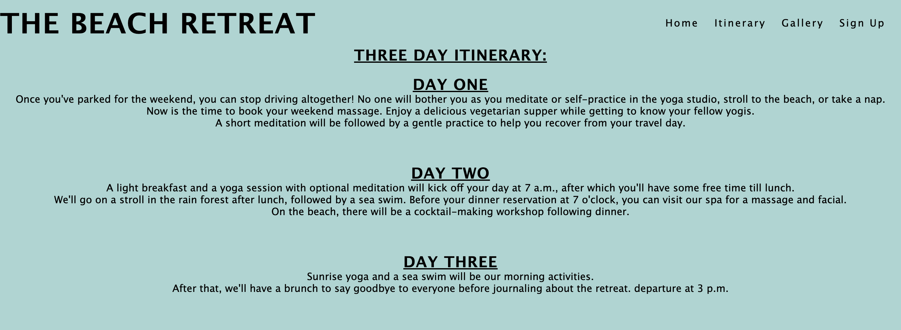

# The Beach Retreat

A website called The Beach Retreat aims to develop a 3-day retreat experience. Users looking for a means to get away from reality for a three-day peaceful retreat will be the site's primary audience.

[View Live Site](https://chloekeenan.github.io/project-1/)

  
 ****** 
 

  
# Feautres

# Navigation Bar

- Including a fully responsive navigation bar on all three pages. A logo and links to the Home page, Gallery, and Sign Up page are included. It is the same on every page to make navigation simple for the user. 

- Through this area, users can easily navigate between pages on all platforms without having to use the "back" button to go back to the previous page. 

- The nav bar's underlining function is used to make it easy for users to see the page they are currently on. 

 

# Landing Page
- To give the customer a sense of where the beach retreat is located, the landing page features a picture of the beach.

- With a sizable, high-impact graphic, this part introduces the viewer to The Beach Retreat and draws in potential visitors.

- A call to action button to sign up and learn more about the retreat is also included on the landing page.

 
  

# The Footer

- Including a fully responsive footer navigation bar on all four pages. It contains links to Twitter, Facebook, and Instagram. It is the same on every page to make navigation simple for the user.

- The user benefits from the footer since it encourages them to stay engaged on social media..

  

# Itinerary
 - The user can view The Beach Retreat's itinerary and the schedule of events for the three days in the about section.

  

 
#   Gallery
  - The user will have access to supporting photographs in the gallery section so they can view idealized pictures of The Beach Retreat.
   I would like to post consumer testimonials after the retreat.

- The user can learn more about the three-day retreat and the services it offers by examining this section.

  

# Sign Up Page

 - The consumer can get in touch with the company through this page to express interest in The Beach Retreat.

 - After the sign up form has been completed and submitted, a straightforward success page thanking the user is linked to. Since this is still a project, no data is sent.

  
    

# Current Features
 
 - An attractive responsive design that works with screens up to 320 pixels wide.
Each external link has an appropriate aria label and opens in a new tab.
Sign up with a link to the user's success page.

# Future Features

- A feature of a reservation option that lets you pick the room of your choice.

- Adding a map showing the retreat's location
adding video footage of actual meditation practice.

- I haven't made a 404 page because the site is only a four-page static static site; but, if the features grow and there may be dead links, I will develop a 404 page.

# Testing 

- Chrome Developer Tools to test the responsiveness of pages The site was tested on Safari, a desktop computer, an iPad, and an iphone 12.

- No photos are pixelated or stretched on the website, which is responsive on all screen sizes. Nothing overlaps.

- Every link on the website has been checked to ensure that it operates as intended, opens in the proper tab, and, if it is an external link, opens in a new browser tab.

# Validation Testing

- HTML: When running through the official W3C validator, no issues were reported.
   [W3 Validator]( https://validator.w3.org/nu/?doc=https%3A%2F%2Fchloekeenan.github.io%2Fproject-1%2F)

- CSS: When running through the official W3C validator, no issues were reported.
[W3 Validator](https://jigsaw.w3.org/css-validator/validator )

- Lighthouse: The results of testing the website using Lighthouse are listed below.

**Home Page**

  

**Itinerary**
   

**Gallery**
   

  **Sign Up**
   

# Deployment 

- Github Pages was used to deploy the website. The following are the deployment steps:
- Find the Github repository "project-1" after signing in to Github.
- Select "Settings" from the drop-down menu at the repository's top.
- On the left-hand side navigation menu, select "Pages."
- If it is not already selected, choose "Deploy from a branch" under "Source".
- Choose "main" and "root" from the drop-down choices underneath "Branch."
Select "Save"
- he live link should display beneath the heading "Github Pages" once the page has refreshed.

You can view the link here: (https://chloekeenan.github.io/project-1/)

# Credits 

Although I wrote all of the content, I was inspired by past coastal meditation retreats. These are the websites that I visited for research: 

- https://www.healthandfitnesstravel.com/caribbean/turks-caicos/como-parrot-cay/yoga-pilates/ 

- https://www.healthandfitnesstravel.com/africa-indian-ocean/morocco/paradis-plage/yoga-holiday/ 

- https://www.healthandfitnesstravel.com/yoga-holidays 

- The footer's icons were from Font Awesome. (https://fontawesome.com/)

- Using [amiresponsive] (https://ui.dev/amiresponsive), I produced responsive mockups. 

- For colour codes I used (https://html-color-codes.info/colors-from-image/)

- I used (https://www.w3schools.com/css/css3_object-fit.asp) for object fit. 
